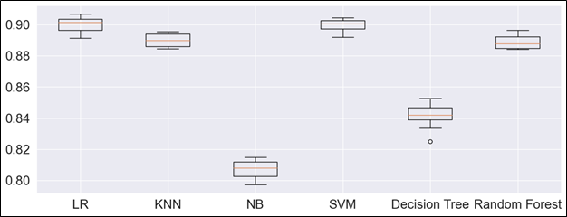

# Учебная ознакомительная практика ИИиНД
## Задачи практики:
* 	Анализ методов бинарной классификации.
*	Анализ данных.
*	Проведение сравнения результативности методов бинарной классификации.

## Результаты работы
